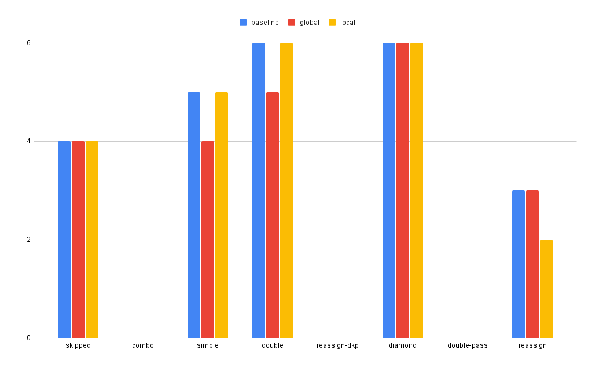
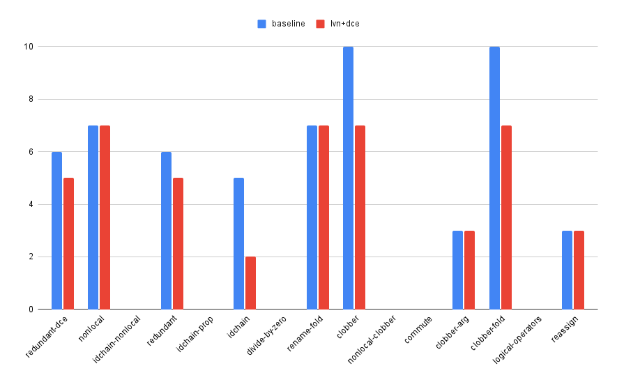

# Task01: Local Optimization

CS265, Chengyi Lux Zhang

link: https://github.com/iansseijelly/bril/tree/main/examples/01-local-opt 

This directory contains various transformations for local optimizations. 

## Setting Up
(For my own notes) I installed everything in conda, and the install script does not work 100% for me... 
So run this in every fresh terminal:
```
conda activate bril
export PATH="$HOME/.local/bin:$PATH"
```

## Trivial DCE
It is implemented in `global_tdce.py`. It makes 3 passes of the IR:
1. in the first pass, it extracts all used variables. Used simply means present in some argument somewhere. 
2. in the second pass, it marks all unused destinations by changing their opcode to nop. 
3. in the third pass, it removes all nops. 

Of course, one could argue it is always possible to merge the 2nd and 3rd passes into one. But not modifying the list during iteration is a good engineering practice, so I insist this marking -> removing paradigm throughout the implementation. 

## Blocked Local DCE
I implemented my own block extraction and cfg construction in `cfg.py`. It uses networkx for graph utilities and makes 2 passes of the IR:
1. in the first pass, it constructs all the blocks and form them as nodes. 
2. in the second pass, it connects all the edges. 

The node is constructed under the assumption that every block other than the first must start with a label. I gave the first node a dummy label called "entry". 
The edges are connected by the following rule:
```
if block.insn[-1] is br or jmp:
    # connect it to all label fields
else:
    # fallthrough: connect it to the next block
```
The edges turn out to not be useful at all, but they're good to have. 

This is implemented as a library, not part of the pass pipeline. Passes that wish to use this pass should call this library to construct the cfg, and operate on it. They should return a json eventually, which is handled by the helper `cfg_to_instrs(cfg)`.

Then the local dce looks at each individual blocks and eliminates double assignment. It looks at variables whose assignment are unused before reassignment, and then prune the previous assignment. The lookups are handled by a dictionary lookup with {key, value} -> {dest, insn}.

## LVN
My LVN implementation is in `lvn.py`. It uses my `cfg.py` for block reconstruction. It makes these key design decisions:
1. It handles uninitialized read before write on the fly, by creating entries for them and marking them as `uninferable`. 
2. It uses one big `OrderedDict` for storing all local value numbering. This is driven by the observation that the numbers themselves are not critical: lookups are either done by key lookups for value lookups. Hence, an datastructure does not need to book-keep the numbers, but rather the value and the expression that derives it. 
3. It performs `reverse_lookup` in case of finding value matches, instead of keeping a separate reverse dictionary. This is purely for the sake of engineering cleanness, at the cost of perhaps slower lookups. 
4. It marks common subexpressions by changing their opcode to id, and do them eliminate the common subexpr directly. This is the best we can do without performing proper dataflow analysis. Otherwise, in cases three blocks looking like this will fail if we try to remove sum2 completely in block1. However, it is not possible for us to reason about when the remove it without proper dataflow analysis.
    ```
    block1:
    sum1 = a + b
    sum2 = a + b

    block2:
    sum2 = 3

    block3
    print sum1 + sum2
    
    block 1 -> block 2
    block 2 -> block 3
    block 1 -> block 3
    ```
    If an id is later proven to be useless, then a separate global DCE pass must engage and make the call. Hence, in my brench_lvn.toml, it also includes a global DCE pass. 
 
5. Clobbered values are naturally "updated" instead of "appended". The old value will be replaced with newer ones".
6. It iteratively finds for a non-id operation while it can. This helps to dig through the idchains.  

## Evaluation

In general, brench says "missing" for some benchmarks. This is likely due to a regex engine bug somewhere, so I just manually ran those that says "missing".

### Global DCE
In `test/tdce/simple.bril`:
```
simple,baseline,5
simple,global_dce,4
simple,local_dce,5
```
We observe the global dce correctly removes the excessive assignment to c. 

```
double-pass,baseline,6
double-pass,global_dce,5
double-pass,local_dce,6
```
We observe that global dce removes the first excessive assignment. This removal should make c assignment deadcode as well. To fix this, we can make globale_dce iterate until convergence (no more available removals.) This is implemented in `global_dce_iter.py` and it indeed brings the counts down to 4. 
```
(bril) $ diff global_dce.py global_dce_iter.py 
27c27,30
<     return [instr for instr in instrs if should_keep(instr)]
---
>     # return if anything is optimized
>     should_retry = any(not should_keep(instr) for instr in instrs)
>     instrs = [instr for instr in instrs if should_keep(instr)]
>     return instrs, should_retry
33,35c36,41
<     for fn in prog["functions"]:
<         log_file.write(f"--> Processing function {fn['name']} -->\n")
<         used = all_used(fn["instrs"])
---
>     should_retry = True
>     while should_retry:
>         should_retry = False
>         for fn in prog["functions"]:
>             log_file.write(f"--> Processing function {fn['name']} -->\n")
>             used = all_used(fn["instrs"])
37c43
<         fn["instrs"] = remove_nops(fn["instrs"])
---
>         fn["instrs"], should_retry = remove_nops(fn["instrs"])
```

### Local DCE
Since this optimization really only targets double assignment, the only relevant benchmark is `test/tdce/reassign.bril`. It almost does not do anything in all other tests. 
```
reassign,baseline,3
reassign,global_dce,3
reassign,local_dce,2
```
It correctly prunes a double assignment, where the first one is never used. 

#### Special Note:
**All empty columns are `missing`, probably due to a brench regex parsing issue, instead of `incorrect`.**



### LVN
This LVN is not too surprising to underperform because it is a weak form of CSE that does not account for dataflow, so it tends to be quite conservative. 



It performs very well for `clobber` and `idchain`. This is not too surprising, because all ids in the chain turns out to not be useful on purpose. As the log suggests, it correctly identifies the common sub expressions and substitute them with `id`, and try to stick to one expression in the following argument analysis. The global dce then picks them up and removes the useless ids. 

### Reflection

Programs that works well:
```
//id_chain.bril
@main {
  x: int = const 4;
  copy1: int = id x;
  copy2: int = id copy1;
  copy3: int = id copy2;
  print copy3;
}
```
This is well optimized by our optimizer because:
1. We iteratively find the most common subexpr
2. The fact that there's only one control flow and hence one basic block makes the global dce perform. well. 

Programs that does not work well:
```
@main {
	x: int = const 4;
	y: int = const 8;
	sum1: int = add x y;
	sum2: int = add x y;
	br sum1 .L1 .L2;
.L1:
	sum2 = add sum2 sum1
.L2:
	sum3: int = mul sum1 sum2;
	print sum3;
}
```
This does not work well because:
1. We have no dataflow analysis
2. We have no commutative passes
3. We have no constant folding
Overall, this makes our optimization passes unable to do anything, whereas in reality everything can be folded to printing a constant. 