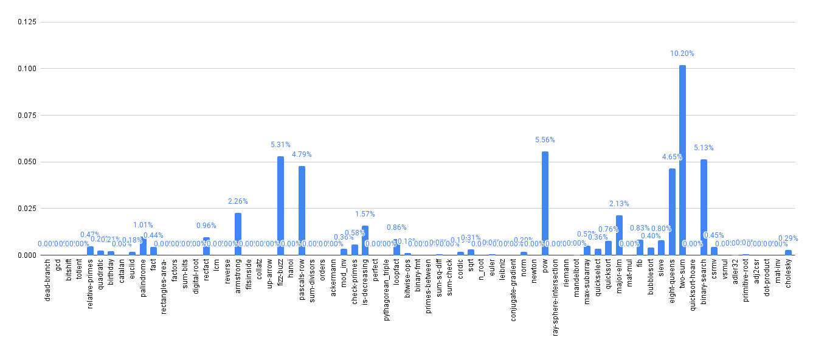

# Task02: Dataflow

CS 265, Chengyi Lux Zhang

link: https://github.com/iansseijelly/bril/tree/main/examples/02-dataflow

This directory contains a transformation pass for dataflow analysis of constant propagation & folding and liveliness analysis. 

## CFG
I implemented my own block extraction and cfg construction in `cfg.py`. It uses networkx for graph utilities and makes 2 passes of the IR:
1. in the first pass, it constructs all the blocks and form them as nodes. 
2. in the second pass, it connects all the edges. 

The node is constructed under the assumption that every block other than the first must start with a label. I gave the first node a dummy label called "entry". 
The edges are connected by the following rule:
```
if block.insn[-1] is br or jmp:
    # connect it to all label fields
else:
    # fallthrough: connect it to the next block
```
Comparing to task-01, the edges are very useful here. Additionally I also fixed a bug where, a block with no instruction will not panic. This is a rare edge case for exit label-only blocks. 

I also realized the design decision of using graphviz is quite handy because it offers pretty APIs for things like finding successors, predecessors, and post-order traversal to populate the work lists. This makes my cfg implementation quite handy :). 

This is implemented as a library, not part of the pass pipeline. Passes that wish to use this pass should call this library to construct the cfg, and operate on it. They should return a json eventually, which is handled by the helper `cfg_to_instrs(cfg)`.

## Constant Propagation and Folding
I used a worklist implementation, starting with a postorder list. It intersects all the predecessor's constant maps, and walks through the current block. It populates both the constant map and tries to fold the operations which it knows are constant in the end. This is find and correct because the pass is pessimistic, it goes in as nothing is constant. So every update of the constant must be expanding its frontier of knowledge, and guaranteed to be correct. 

The constant maps are implemented as a dictionary of str -> dict, mapping from block label to their respective constant map. This ensures that one's update of its own constant map does not pollute the others, unless they are neighbouring edges. In such cases, the pass would put all the potentially affected successors back into the work list and replay them. If the update looks identical to the already known constant map, then there's no explicit need to redo the successors. This makes sure the algorithm converges. 

There's no explicit need for separating in and out sets, because the optimization is done on the fly, as the const map is being updated. We'll see later that this is not the case for the liveliness pass. 

The meet function is intersection. It creates a new empty set to prevent unwanted invasive changes to the sources. 

## Liveliness Analysis
I also used a worklist implementation, starting with a reversed postorder list. It uses two sets of maps, a per-block in live map and a per-block out live map. This is necessary, as this pass has two phases. First, it fully constructs the in and out maps. It cannot perform optimizations on-the-fly, because a block's out map may not contain all live variables at the early stages of the passes. Pre-mature optimization will thus cause false positives. 

In the second phase, it walks through the instruction is reversed orders, and check if the assignment is non-alive and also not used locally. This is necessary, consider the following case:
```
end:
x: int = const 42;
print x;
```
This is the last block and x is not live at the end, but removing the assignment to x is clearly not safe. 

The second pass marks those who are safe to remove as nop, and a later trivial remove_nop pass clean things up. This is purely for the safety of not modifying the iterator. 

## Evaluation

We run both passes, as constant propagation and logging itself would only transform operations and not actually remove anything. The results of running `brench brench_benchmark.toml` are shown below: 



As we can observe, the dataflow pass is quite effective at some workloads. It performs the best on `two-sum`, and achives very decent performance (around 5% less instructions) on a variety of benchmarks. There are also a large quantity of benchmarks that are totally unoptimzied. 