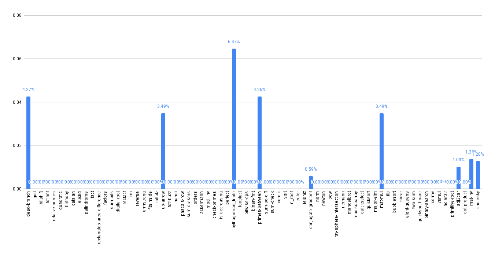

# Task03: Loop Invariant Code Motion

CS 265, Chengyi Lux Zhang

link: https://github.com/iansseijelly/bril/tree/main/examples/03-loop

This directory contains a transformation pass for ssa construction and loop analysis. 

## CFG

The CFG is more or less unchaged from last time. I realized that some bril functions call their entry node `entry`, and it made my cfg confused... The solution is to rename my inserted entry node to `sentinel_entry`. 

## SSA

This part took the majority of my time. 
It is quite a lot of to implement. `ssa.py` translates the bril program to ssa form. It referred to a lot of construction in `example/to_ssa.py`, like the flow of 
```
getting phi -> rename -> insert phi.
``` 
This makes it very clean and not modify the program until the very last, making iteration easy. 

I also realized the reference `example/from_ssa.py` does not work out of the box. For many benchmarks it will produce non-existent symbols. 
I tried a few ways to convert back from ssa and they all have too many unhandled edge cases... Looks like no matter where do I put the `id` it is not good enough. Eventually, I just chose to not convert back from ssa at all. 

## Loop Normalization

I normalize the loop to always look like 
```
preheader -> header -> [body] -> latch -> header
```
In the process, I came to the realization that not adding terminators in the cfg blocks (allowing fall-through) made my life a million times harder (lol), so I eventually conceded and just added the (oftentimes useless) jumps. 
The loop normalization passes also handle nested loops and shared header loops correctly, by normalizing loop groups with shared headers. It puts a single latch that all back-edges point to, and put a single preheader. 

## LICM

My LICM pass first construct an invariant map outside of the target loop. It understands what variables are unchanged outside the loop. 

Then, using this information, it digs into the loop for invariant assignments. Once it is found, it would hoist it up to the preheader. It adds a check to make sure the "identified" preheader node is the sole predecessor of the loop header, other than the backedge - in case someone calls this pass without calling normalization first. In cases of normalized loops, this should always be the case. 

## Evaluation

I run a brench comparison between with and without licm. The baseline is loop normalization + ssa, and the optimized version is loop norm + ssa + licm.  

[This link](https://docs.google.com/spreadsheets/d/12mtxG8ja89oiqFjuu4fZcAQnq3IsoyqKdS58JzMF3_s/edit?gid=776043870#gid=776043870) is the spreadsheet to the complete results of running brench.



Among all benchmarks, it does nothing to the majority of them (only 8/72 benchmarks are optimized). The `pythagorean_triple.bril` program benefits the most (6.47%), and four other benchmarks benefited more. Additionally, 3 other benchmarks benefited very minorly. (~1%)

TBH, feels like this time the effort does not justify the benefit (comparing to the results in dataflow especially)
